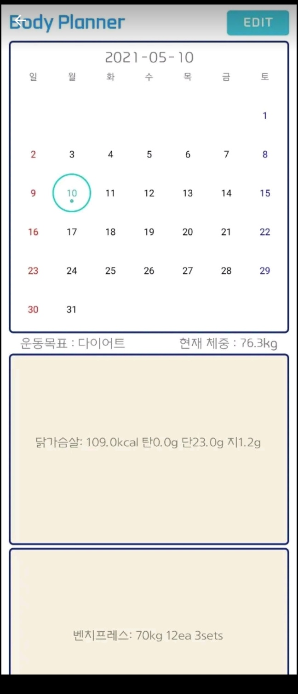
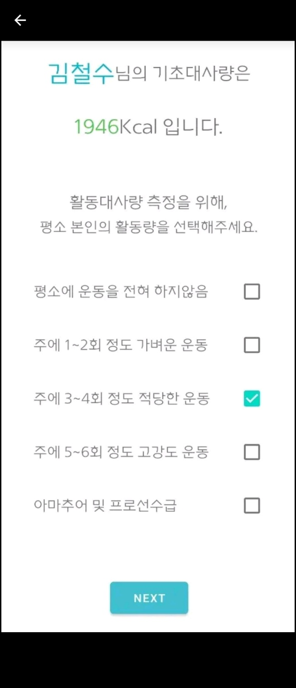
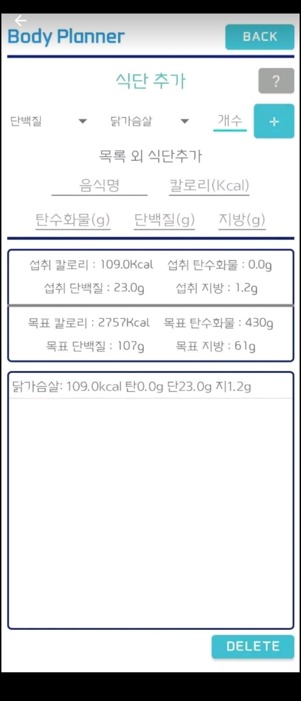
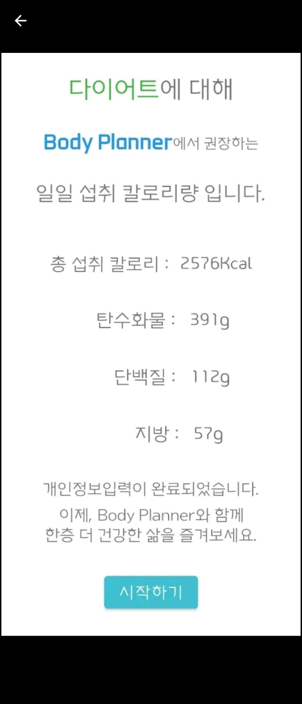

## BodyPlanner
개발 팀 : 조민수, 김광모

제작 기간 : 2021.03 - 2021.05

### Project 개요 
  - 헬스를 하는 사용자들에게 웨이트/유산소 트레이닝의 Daily 기록 및 운동 목표에 따른 식단 기록 어플리케이션 
  
### Project 개발 과정 
  - Android Studio를 통한 Android Native 개발 
  - FatSecret을 통한 각 식단 별 영양소 DB 생성 <a href="https://www.fatsecret.kr/">LINK</a>

### Application Download Link  
<a href="https://play.google.com/console/u/0/developers/4646059689067145200/app/4976338209443517309/app-dashboard?timespan=thirtyDays">Body Planner</a>

### Application

 | 
 | 

